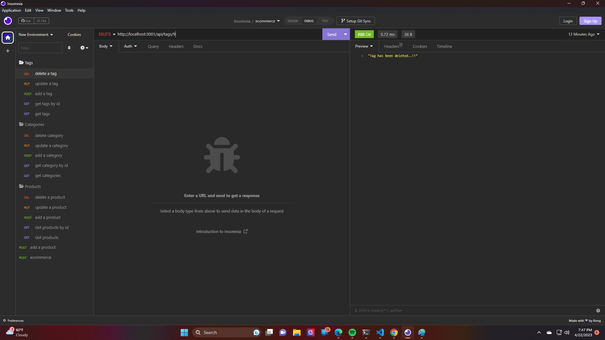
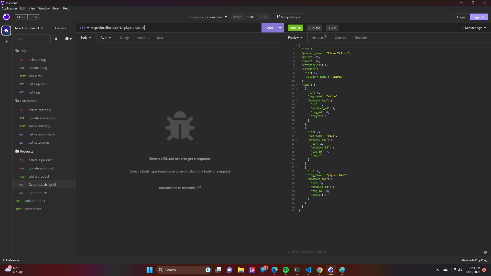
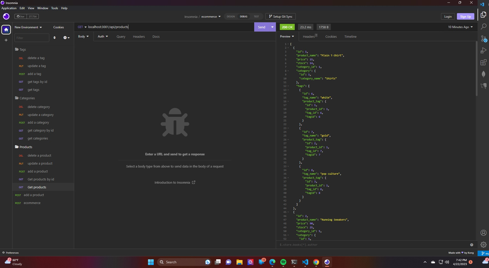
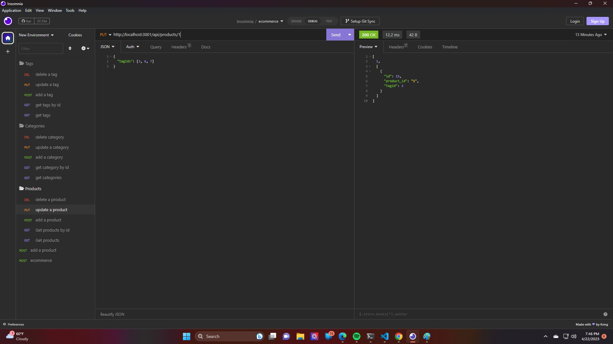

# E-Commerce

## Description

The back end for an e-commerce site using an Express.js API to use Sequelize to interact with a MySQL database.

- The motivation for this application was to enable the user to manage, update, and delete inventory.
- This project was built to streamline the inventory process and improve the efficiency of a retail company.
- This apploication solves the problem of organization, speed, and ease of use.
- In this process I learned about ORM back-end technologies, Mysql, and insomnia.

## Table of Contents 

- [Installation](#installation)
- [Screenshots](#screenshots)
- [Walk-Through-Video](#Walk-Through-Video)

## Installation

npm install [MYSQL2, sequelize, dotenv]

## Screenshots

   

## Walk-Through-Video

https://drive.google.com/file/d/1mTKuzpIYy9HCj14ZX7ugRHyweIX2pdb6/view

